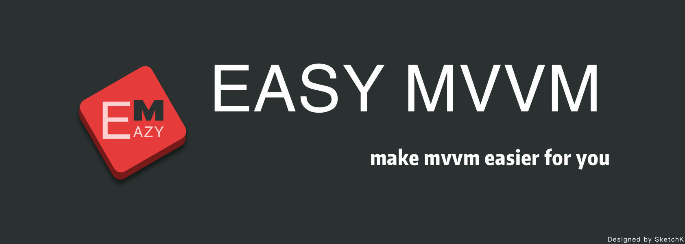

## EasyMVVM 是什么?

EasyMVVM是EasyReact的上层框架,可以用来作为MVVM的最佳实践。

## 特性

+ [x] 可监听的 action
+ [x] 绑定一个 action 到 UIButton 上
+ [x] 串行／并行执行若干个 action
+ [x] 在值变化时执行一个action并将值本身作为参数
+ [x] UIControls 和 UIGestureRecognizers 支持可监听的 value 扩展
+ [x] 内存高速数据交换中心
+ [x] 事件对象 Event 和事件处理行为 Handler
+ [x] 数据绑定，和事件绑定API
+ [x] 带有修改记录的容器

## 系统需求

+ iOS 8.0+
+ Xcode 8.0+

## 如何运行示例项目

clone 本项目，在 Example 文件夹下执行`pod install`，然后打开`EasyMVVM.xcworkspace`.

## 安装

### CocoaPods

在`Podfile`中添加

```ruby
pod 'EasyMVVM'
```
然后运行`pod install`即可

## 如何使用 (如需更详细的例子，请查看示例工程 Tests 文件夹下的测试用例)

### 可监听结果和错误的 Action

```objective-c
ERAction<NSNumber *> *action = [[ERAction alloc] initWithBlock:^(id param, EZRNode *result, EZRNode<NSError *> *error) {
    result.value = @([param integERNode] * 10);
}];
[action execute:@123];
// action.result.value => @1230

ERAction *action = [ERAction actionWithBlock:^(id param, EZRNode *result, EZRNode<NSError *> *error) {
    if (!param) {
        error.value = [NSError errorWithDomain:@"xx" code:123 userInfo:@{@"reason": @"param is nil"}];
    } else {
        result.value = @"succ";
    }
}];
[action execute:nil];
// action.error.value => [NSError errorWithDomain:@"xx" code:123 userInfo:@{@"reason": @"param is nil"}];
```

## 单元测试

EasyMVVM 包含了完善的单元测试，相关代码在示例工程的 Tests 文件夹下。你可以打开示例工程并执行 Test 命令来运行这些单元测试。


## Author

WilliamZang, chengwei.zang.1985@gmail.com  
姜沂, nero_jy@qq.com
Qin Hong, qinhong@face2d.com
SketchK, zhangsiqi1988@gmail.com

## License

EasyReact is [Apache Public License 2.0](https://github.com/Meituan-Dianping/EasyMVVM/blob/master/LICENSE)
